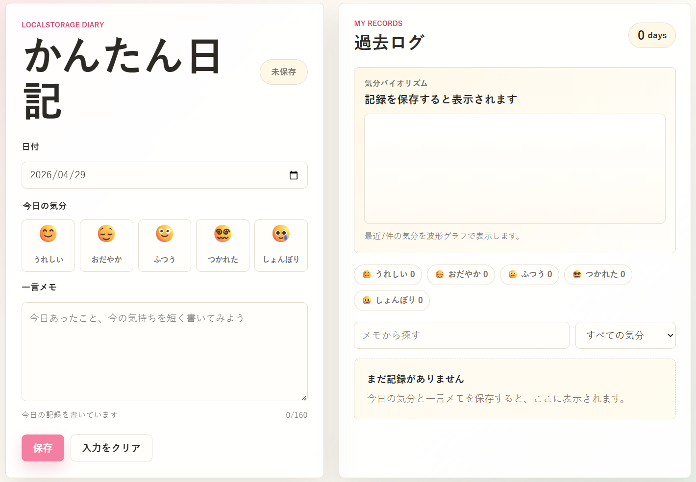

# 学習ログ

HTML/CSS/JavaScriptとlocalStorageだけで動く、調子を記録できる学習支援アプリです。

日付ごとに「今日の調子」と「今日の学習メモ」を保存できます。保存した記録はブラウザのlocalStorageに残るため、ページを閉じても同じブラウザで再度開けば過去の学習記録を確認できます。

## 📱 デモ

🔗 [https://gigaschool.github.io/tiny-diary/](https://gigaschool.github.io/tiny-diary/)



## デモの動かし方

`index.html` をブラウザで開くだけで使えます。ビルドやサーバー起動は不要です。

```text
study-log/
├── index.html
├── styles.css
├── app.js
├── README.md
└── LICENSE
```

## 機能

- 今日の日付を自動セット
- 調子を5段階から選択（絶好調〜集中困難）
- 学習メモを保存
- 日付ごとに1件の記録として保存
- 同じ日付で保存すると上書き
- 学習記録の一覧表示
- 保存済み記録の編集
- 保存済み記録の削除
- 学習内容検索
- 調子フィルター
- 最近7件の調子の流れを表示するsin曲線風の調子推移グラフ

## 使用技術

- HTML
- CSS
- JavaScript
- localStorage

外部ライブラリは使っていません。

## localStorage

保存キーは `study-log.entries.v1` です。

データは次のような配列で保存されます。

```json
[
  {
    "id": "example-id",
    "date": "2026-04-29",
    "mood": "happy",
    "note": "数学の因数分解を復習。英単語20個を覚える。",
    "createdAt": "2026-04-29T10:00:00.000Z",
    "updatedAt": "2026-04-29T10:00:00.000Z"
  }
]
```

## 調子データ

調子は次の5段階です。

| 値 | 表示 | スコア |
| --- | --- | --- |
| `happy` | 絶好調 | 5 |
| `calm` | 好調 | 4 |
| `normal` | 通常 | 3 |
| `tired` | 疲れ気味 | 2 |
| `sad` | 集中困難 | 1 |

調子推移グラフでは、最近7件の記録をこのスコアに変換して、SVGの波形グラフとして表示します。

## 教材で説明しやすい流れ

1. フォームから値を受け取る
2. JavaScriptの配列に学習データを追加する
3. `JSON.stringify` でlocalStorageへ保存する
4. `JSON.parse` でlocalStorageから読み込む
5. 配列をもとに一覧と調子推移グラフを再描画する

## ファイル構成

- `index.html`: 画面の構造
- `styles.css`: レイアウトと見た目
- `app.js`: 保存、表示、編集、削除、検索、調子推移描画
- `README.md`: この説明ファイル
- `LICENSE`: MITライセンス

## ライセンス

MIT License

---

## 📝 このリポジトリについて

このリポジトリは、学習ログアプリを育てるための土台として使います。
